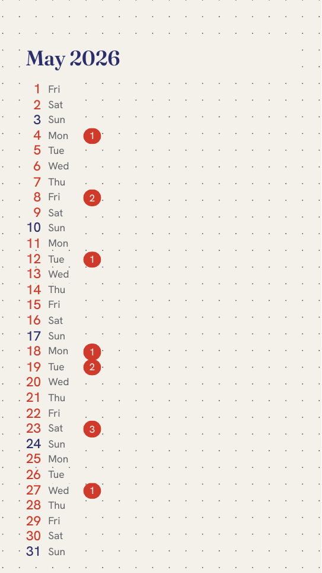
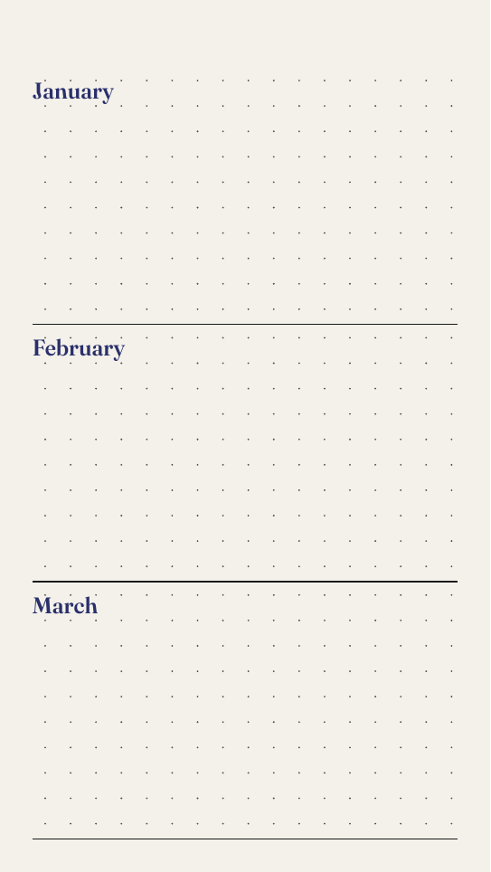
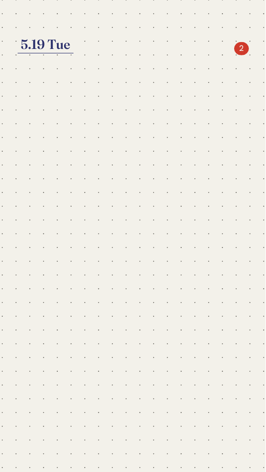
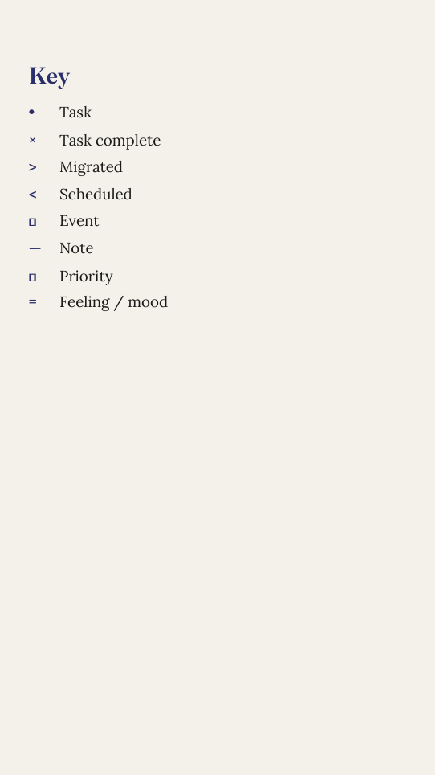
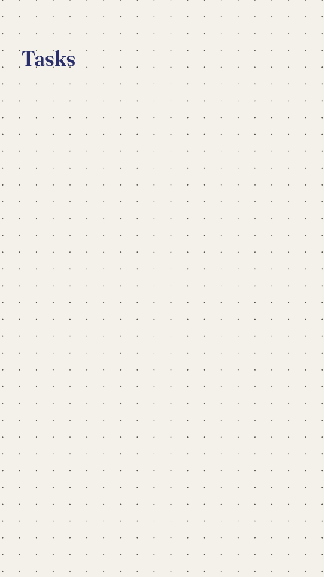

# rmbujo

**A dot-grid bullet-journal generator for reMarkable e-ink tablets.**

`rmbujo` builds a full year of clean, typeset PDF notebooks — a future log, twelve
monthly notebooks, a reference key, and collection templates — sized exactly for the
[reMarkable Paper Pro](https://remarkable.com) and Paper Pro Move. It overlays your
real calendar (any ICS / webcal feed) onto each month, then syncs everything to the
device **without ever touching your handwriting**.

It's written in Rust and renders HTML/CSS straight to PDF with
[fulgur](https://crates.io/crates/fulgur) (Blitz + krilla) — there is no headless
browser involved, so output is fast and byte-for-byte deterministic.

<p align="center">
  
  &nbsp;&nbsp;
  
  &nbsp;&nbsp;
  
</p>

---

## Why this exists

Stock reMarkable templates are fine, but a bullet journal wants a few things they
don't give you:

- **One notebook per month**, each a tidy index of numbered days, with a tappable
  link from any day to its own detail page.
- **Your calendar, on the page.** Holidays, work meetings, appointments — pulled from
  ICS feeds and printed right next to the day, with a colored swatch per calendar.
- **Handwriting that survives regeneration.** When your calendar changes, rmbujo
  refreshes only the printed background via reMarkable's *content-only* sync. Anything
  you've written by hand stays exactly where it is.
- **A dot grid that matches the device.** Spacing lines up with reMarkable's built-in
  *Dots Small* template, so pages you add on the tablet blend right in.

If you keep an analog-style journal on a reMarkable but want it pre-loaded with the
year's structure and your calendar, that's what this is for.

## What it produces

A single flat folder per year, one PDF per notebook:

| File                          | What it is                                                        |
| ----------------------------- | ----------------------------------------------------------------- |
| `2026 Future Log.pdf`         | Year-at-a-glance spread, one block per month                      |
| `2026.01 January.pdf` … `.12` | One notebook per month: day index + a detail page for every day   |
| `2026 Collection Template.pdf`| Blank dot-grid + task pages for ad-hoc collections                 |
| `2026 Reference.pdf`          | The bullet-journal key (task, event, migrated, note, …)           |

### A look inside

<table>
<tr>
<td align="center"><br><sub><b>Monthly index</b> — every day, with a badge counting that day's events.</sub></td>
<td align="center"><br><sub><b>Day detail</b> — full agenda with times, location, notes, and a color per calendar.</sub></td>
<td align="center"><br><sub><b>Future log</b> — the year at a glance.</sub></td>
</tr>
<tr>
<td align="center"><br><sub><b>Daily writing page</b> — dot grid with the date and a tap-back link.</sub></td>
<td align="center"><br><sub><b>Reference key</b> — the bullet-journal notation legend.</sub></td>
<td align="center"><br><sub><b>Collection template</b> — blank pages for lists and trackers.</sub></td>
</tr>
</table>

> The calendar entries shown above (Victoria Day, Dentist, Lunch with Sam, …) are
> fictional sample data, not a real calendar.

## Install

Dependencies are managed with [Nix](https://nixos.org). With
[direnv](https://direnv.net):

```sh
direnv allow        # loads the flake dev shell automatically
```

Or manually:

```sh
nix develop         # drops you into a shell with everything available
nix build           # builds the rmbujo binary into ./result/bin/rmbujo
```

## Quick start

Create a new year with the interactive wizard. It asks for the base folder, year,
device, calendar feeds, and sync settings, writes a `<base>/<year>/rmbujo.toml`, then
generates (and optionally uploads) the PDFs:

```sh
rmbujo new
```

That's the whole setup. Everything below is for re-running once a config exists.

## Usage

```sh
# Regenerate an existing year from its config (reuses cached calendar feeds — fast & offline).
rmbujo path/to/2026/rmbujo.toml

# Same, but re-fetch every ICS feed first.
rmbujo path/to/2026/rmbujo.toml --refresh-feeds

# Regenerate a single month and upsert it to a target folder (used by automated jobs).
rmbujo month path/to/2026/rmbujo.toml --month 5 --target /
```

## Calendar feeds (ICS)

Add feeds to `rmbujo.toml` (or let `rmbujo new` prompt you for them one at a time).
Each feed's events are overlaid on the monthly notebooks:

```toml
timezone = "America/Toronto"   # IANA timezone — used for all event rendering

[[ics]]
name = "Holidays"
url  = "https://example.com/holidays.ics"   # color omitted → auto-assigned

[[ics]]
name  = "Work"
url   = "webcal://example.com/work.ics"      # webcal:// is accepted (treated as https)
color = "primary"                            # optional override
```

- **Colors are automatic.** Omit `color` and each feed gets a distinct shade from a
  10-color palette, in order — so multiple calendars stay readable with zero setup.
  To pin one, set `color` to `primary` (indigo), `accent` (tomato), `rust`, `muted`,
  or `cal1`…`cal10`. An unknown name is rejected with the list of valid options.
- **Full detail.** Events render with their start time on the day index; the detail
  page shows the start–end range, location, notes, and attendees when the feed
  provides them.
- **Robust timezones.** IANA names, fixed offsets (`GMT+0200`), and Windows/Outlook
  names (`Eastern Standard Time`) are all handled and converted to your configured
  `timezone`.
- **Cached & reproducible.** Fetched feeds are cached under `<year>/.ics-cache/`. A
  plain regenerate reuses the snapshot — fast, deterministic, and offline. Pass
  `--refresh-feeds` to force a re-fetch.

## Syncing to the reMarkable (rmapi)

Set `deploy.backend = "rmapi"` and `deploy.base_folder = "/rmbujo"` in `rmbujo.toml`
(the `new` wizard prompts for both). Pair once: run `rmapi` and paste a code from
<https://my.remarkable.com/device/desktop/connect>. After that:

- `rmbujo new` uploads the year's PDFs to `<base_folder>/<year>` (e.g. `/rmbujo/2026`).
- `rmbujo path/to/rmbujo.toml` regenerates and re-syncs with `rmapi put
  --content-only`, which **replaces each PDF's printed background without touching
  your handwriting**.

**Device sync rule:** always sync the device *before* running rmbujo, then sync again
after. This guarantees handwriting you added on the device reaches the cloud before
the content-only push, so nothing is lost.

## Adding pages on the device

To insert an extra page directly on the reMarkable, tap **+** and choose the built-in
**Dots Small** template — its dot grid matches rmbujo's spacing exactly. No sideloaded
template is needed.

## Supported devices

| Device                      | `device` key      |
| --------------------------- | ----------------- |
| reMarkable Paper Pro Move   | `paper-pro-move`  |
| reMarkable Paper Pro        | `paper-pro`       |

Paper Pro Move is the primary, most-tested target.

## Development

```sh
make test             # full suite in the Nix shell
make update-goldens   # regenerate visual-regression golden images
make clippy           # lints (warnings are errors)
make build            # nix build the rmbujo package
make hooks            # enable the tracked pre-commit hook (cargo fmt --check)
```

The README screenshots are regenerated from fictional sample data with:

```sh
nix develop -c cargo run --example screenshots   # writes docs/images/*.png
```

## License

[MIT](LICENSE) © Dan Cardamore
